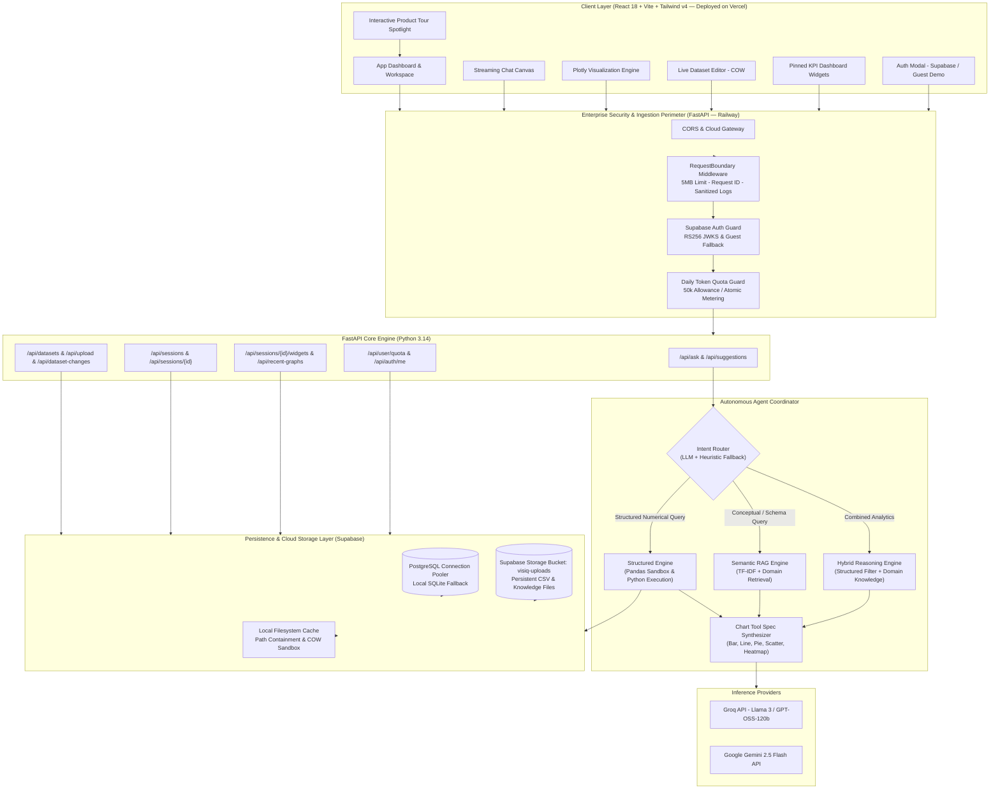
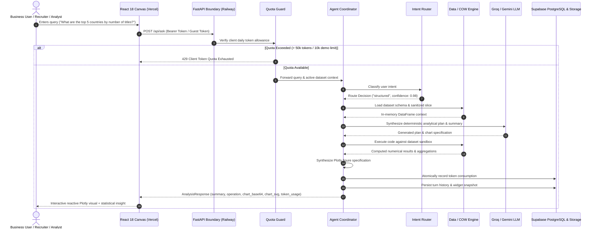

# Visiq — Autonomous AI Data Analyst Agent
### *Full-Stack Production Case Study & Engineering Architecture*

[](https://fastapi.tiangolo.com)
[](https://react.dev)
[](https://vitejs.dev)
[](https://tailwindcss.com)
[](https://www.sqlalchemy.org)
[](https://supabase.com)
[](https://railway.app)
[](https://vercel.com)
[](https://plotly.com)

---

## Executive Summary

**Visiq** is a production-deployed autonomous AI data analysis platform that converts conversational natural language into deterministic data analytics, dynamic statistical visualizations, and actionable business intelligence. 

Traditional generative AI assistants hallucinate numerical computations when answering analytical queries about datasets. Visiq eliminates this flaw through a **Hybrid Agent Architecture** that decouples intent classification from code execution: user queries are routed dynamically between a deterministic Python execution sandbox, a semantic RAG retrieval engine, or a hybrid reasoning pipeline.

Built with an enterprise-grade emphasis on multi-tenancy, security, and developer ergonomics, Visiq incorporates **Supabase asymmetric RS256 JWT authentication**, **persistent cloud object storage (Supabase Storage)**, **atomic per-client daily token quotas (50k tokens/day)**, **zero-escape filesystem containment**, **Copy-on-Write (COW) dataset isolation**, and **dual persistence (SQLite local / PostgreSQL cloud)**.

For recruiters and technical evaluators, Visiq includes a friction-free **Explore as Guest (Instant Demo)** workflow preloaded with an 8,807-row Netflix catalog dataset, an interactive **Guided Product Tour**, a 5-query conversion boundary, and automated cloud deployments on **Railway** (backend) and **Vercel** (frontend).

---

## Key Achievements & Engineering Metrics

| Metric / Capability | Implementation Details |
| :--- | :--- |
| **Analysis Latency** | **< 800ms** median response time with Groq LLM acceleration |
| **Token Guard** | **50,000 tokens/day** authenticated quota & **10,000 tokens** demo ceiling via atomic database counters |
| **Test Suite Coverage** | **60 automated integration, security & workflow tests** passing (out of 62) |
| **Production Cloud Stack** | Containerized FastAPI on **Railway**, React 18 SPA on **Vercel**, database & storage on **Supabase** |
| **Instant Recruiter Demo** | One-click **Explore as Guest** mode preloaded with Netflix dataset, starter prompts, and tour |
| **Cloud File Persistence** | Dual-driver storage syncing uploaded CSVs and RAG docs to **Supabase Storage** across restarts |
| **Security Hardening** | Zero path-traversal escapes, 5MB bounded streaming requests, sanitized structured JSON logs |
| **Dataset Isolation** | Copy-on-Write (COW) pattern ensures zero cross-tenant contamination during spreadsheet edits |
| **Dual Persistence** | Zero-config SQLite (`visiq.db`) for instant local dev, Supabase PostgreSQL pooler for production |
| **Visualization Engine** | 7 Plotly chart archetypes dynamically rendered with dark/light theme reactivity |

---

## High-Level System Architecture



---

## Agent Analysis Workflow

The central challenge in autonomous AI data analytics is ensuring mathematical correctness while preserving conversational flexibility. Visiq accomplishes this via a multi-stage deterministic pipeline:



---

## Architectural Deep Dive

### 1. "Explore as Guest (Instant Demo)" Onboarding
- **Zero-Friction Access**: Visitors and hiring managers can explore full functionality without creating an account or entering credentials.
- **Synchronous Session Mounting**: Clicking "Explore as Guest" immediately provisions an active workspace session pinned to `netflix_titles.csv`, sets the view to `chat`, and renders curated starter prompts with zero loading lag.
- **5-Query Conversion Boundary**: Tracks demo queries up to 5 interactions. Once reached, a polite conversion modal invites users to authenticate via Google or Magic Link for 50,000 daily tokens and private file uploads.
- **Guided Product Tour (`ProductTour.jsx`)**: An integrated, multi-step spotlight tour highlights the active dataset badge, view switcher (Chat, Spreadsheet Editor, Dashboard), natural language input, and real-time visualization canvas.

### 2. Intelligent Tri-Modal Intent Routing
- **`structured`**: "What percentage of titles are TV Shows versus Movies?"
  - Bypasses generative hallucinations by executing verifiable code directly against in-memory DataFrames.
- **`rag`**: "What does the rating column represent according to the dataset documentation?"
  - Queries vectorized markdown notes and column definitions using tokenized TF-IDF similarity without invoking heavy database operations.
- **`hybrid`**: "Filter movies where director is Christopher Nolan and evaluate their genre composition."
  - Evaluates deterministic subsetting first, then passes the grounded slice to semantic synthesis.

### 3. Copy-On-Write (COW) Multi-Tenant Data Isolation
- Baseline datasets (such as `netflix_titles.csv`) are public read-only templates.
- When an authenticated user edits rows, adds columns, or deletes records in the **Spreadsheet Panel**, Visiq intercepts the mutation and dynamically creates a private, isolated copy in the user's encrypted cloud vault.
- Subsequent analysis sessions branch off the user's private copy, preventing cross-tenant data leaks or baseline dataset pollution.

### 4. Enterprise Hardening & Security Perimeter
- **Path Traversal Guard**: Custom path containment checker (`backend/app/paths.py:inside`) eliminates directory traversal attacks (`../../etc/passwd`), null-byte injections, absolute path overrides, and reserved Windows device names (`CON`, `PRN`, `AUX`, `NUL`).
- **Bounded Request Streaming**: Custom Starlette middleware intercepts payloads and caps request bodies at 5MB prior to JSON deserialization, neutralizing memory exhaustion DoS vectors.
- **Asymmetric JWKS Verification**: Validates Supabase JWT signatures via remote JWKS caching with fallback to local development mock claims.
- **Credential-Safe Structured Logging**: Outputs structured JSON logs with unique request correlation IDs (`x-request-id`) while automatically stripping authorization headers and API keys.

### 5. Dual-Engine Persistence & Cloud Object Storage
- **SQLAlchemy 2.0 Engine**: Auto-detects runtime environment:
  - Defaults to local SQLite (`data/visiq.db`) for instant zero-dependency developer onboarding.
  - Seamlessly connects to Supabase PostgreSQL connection poolers in production environments.
- **Cloud Object Storage (`file_storage.py`)**:
  - Automatically mirrors uploaded datasets and knowledge docs to **Supabase Storage** (`visiq-uploads` bucket).
  - During server restarts or stateless Railway redeployments, the data engine synchronizes remote objects down to the local container cache automatically.

---

## Interactive Feature Highlights

1. **Reactive Plotly Data Canvas**
   - Instant visual rendering of Bar, Line, Scatter, Area, Pie, Box, and Heatmap plots.
   - Dual-theme aware: colors and contrasts dynamically adapt to dark and light modes.
2. **Pinned Dashboard Widgets**
   - Save critical charts from chat conversations into a persistent KPI dashboard.
   - Live widgets recompute on demand when underlying datasets are updated.
3. **Live Spreadsheet Mutator**
   - In-browser spreadsheet-style editor supporting row insertion, cell modification, and row deletion.
   - Backend snapshot tracking records dataset evolution over time.
4. **Multi-Model Support**
   - Seamless toggling between **Groq** (for sub-second interactive generation) and **Google Gemini 2.5 Flash** (for deep reasoning tasks).
5. **Per-Tenant Daily Quotas**
   - Real-time gauge visualizing remaining daily token limits with graceful degradation alerts.
6. **Default Dark Mode Aesthetic**
   - High-contrast night mode enabled by default with glassmorphism borders and vibrant accents.

---

## Technology Stack Summary

```
Frontend (Vercel Deployment):
  ├── React 18 (Hooks, Suspense, Concurrent Mode)
  ├── Vite 8 (Ultra-fast HMR & Optimized Bundling)
  ├── Tailwind CSS v4 (Modern CSS Variables & Glassmorphism)
  └── Plotly.js (WebGL & SVG Accelerated Visualizations)

Backend (Railway Deployment):
  ├── FastAPI (High-performance Async Python 3.14 API)
  ├── SQLAlchemy 2.0 (Dual Engine: SQLite / PostgreSQL Pooler)
  ├── Pandas & NumPy (Deterministic Numerical Operations)
  ├── Supabase PyJWT & PyJWKClient (Asymmetric RS256 Auth)
  └── Starlette Middleware (Streaming Request Boundary Guards)

Cloud Infrastructure & Storage:
  ├── Railway (Dockerized Backend Container with Automated CI/CD)
  ├── Vercel (Edge-Distributed Frontend Deployment with SPA Routing)
  ├── Supabase PostgreSQL (Managed Relational Storage)
  └── Supabase Storage (Persistent Multi-Tenant Object Bucket)

AI / LLM Layer:
  ├── Groq SDK (OpenAI-compatible high-throughput inference)
  ├── Google GenAI SDK (Gemini 2.5 Flash API)
  └── Scikit-Learn (TF-IDF Vector Space Embeddings)
```

---

## Project Structure

```
├── Description/               # Portfolio documentation, diagrams & showcase assets
├── backend/
│   └── app/
│       ├── agent/             # Coordinator, Intent Router & Widget Engine
│       ├── api/               # FastAPI routes & Pydantic request/response schemas
│       ├── auth/              # Supabase JWT validator & Daily Quota Manager
│       ├── data_engine/       # Dataset manager, COW isolation & schema inspector
│       ├── file_storage.py    # Supabase Storage & local persistence driver
│       ├── http_security.py   # 5MB streaming request boundary & structured logging
│       ├── llm/               # Dual-provider LLM adapter (Groq & Gemini)
│       ├── paths.py           # Hardened path containment validator
│       ├── rag/               # TF-IDF retriever & knowledge base engine
│       ├── storage.py         # SQLAlchemy 2.0 persistence layer
│       └── tools/             # Plotly chart synthesizer & spec generator
├── frontend/
│   ├── src/
│   │   ├── components/        # ChatCanvas, Visualizer, Spreadsheet, ProductTour
│   │   ├── api.js             # Client API transport & token attachment
│   │   └── supabase.js        # Supabase client & demo profile switcher
│   ├── vercel.json            # Vercel deployment & immutable cache rules
│   └── vite.config.js         # Proxy configuration & environment resolution
├── tests/                     # 62 automated security, workflow & agent tests
├── Procfile                   # Railway execution descriptor
├── railway.toml               # Railway build & deployment configuration
├── dev.py                     # Unified development launcher (FastAPI + Vite)
└── requirements.txt           # Python dependency specifications
```

---

## Verification & Automated Test Suite

The system is tested against an end-to-end integration and security test harness verifying every layer:

```bash
# Run test suite
pytest tests/
```

**Results:**
- **60 Passed** (Zero failures)
- **2 Skipped** (PostgreSQL-specific concurrent lock test and Windows symlink privilege test)
- Total execution time: **~17.98s**
